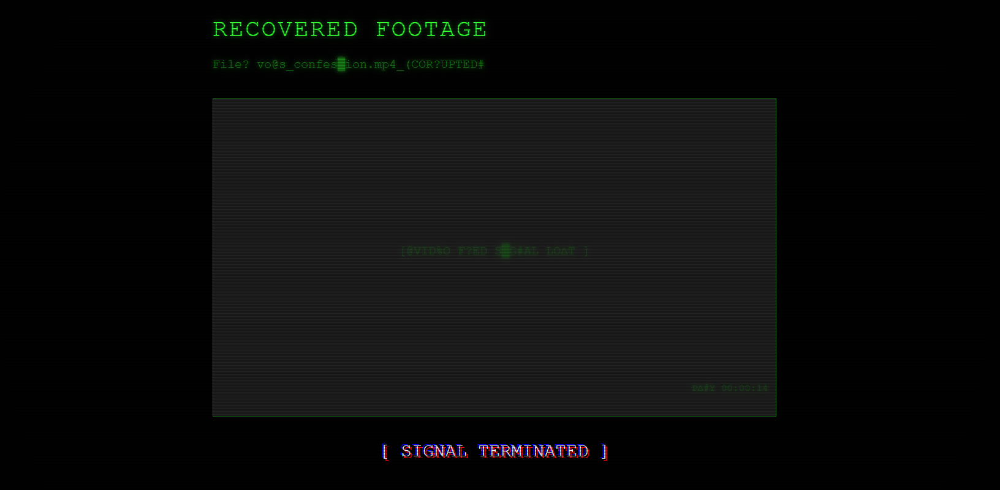
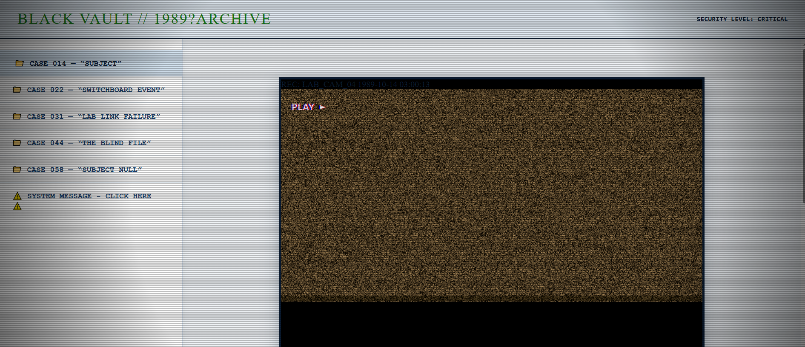

# NX-7429

Check out my new website project I made 👀

A psychological horror / ARG-style web experience inspired by: analog horror, abandoned systems, retro terminals, secret archives, AI experiments, creepy investigation games..

The site is built to feel like you're exploring a forgotten research network connected to a mysterious AI project called **NEXUS**.

## Screenshots

## Features

- Interactive terminal system
- Hidden puzzles and secret pages
- Creepy archive exploration
- Glitch effects & VHS atmosphere
- Fake government databases
- Hidden clues in source code
- Morse / binary / encoded messages
- Dynamic ambient audio
- Psychological horror elements
- 

## Tech Used:
Vanilla HTML/CSS/JS

Web Audio API

## Small Hint 👀

Some things are hidden where you least expect them.

## Live Website

mch2707.github.io/NX-7429/

If you find something strange in the system…

that’s probably intentional.
